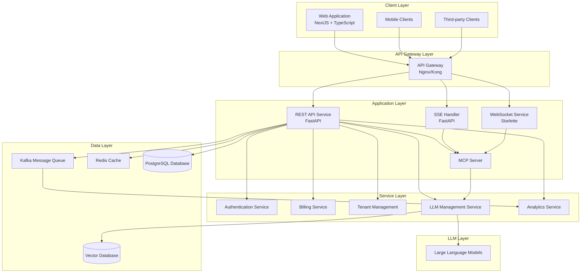
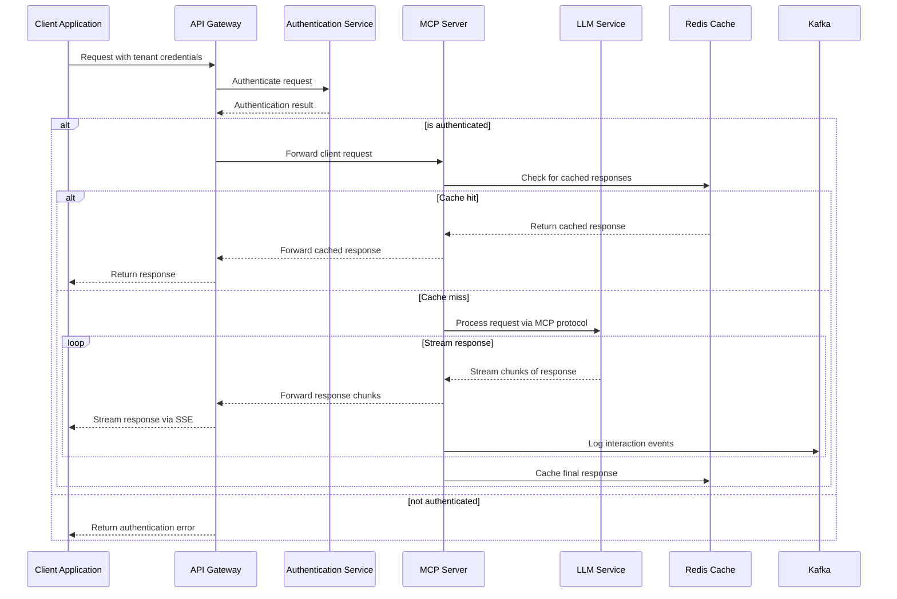
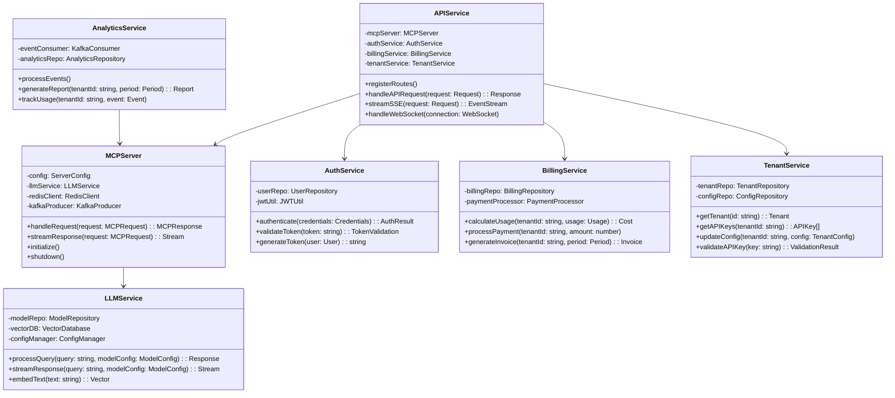
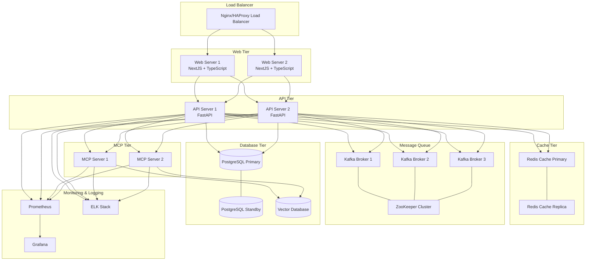
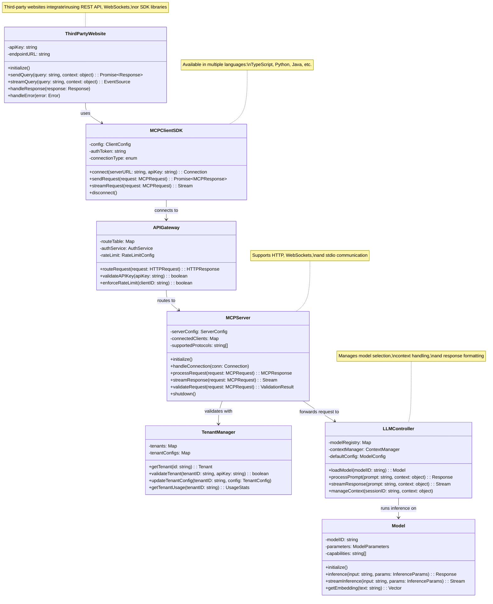

# LMO


This is a comprehensive high-level and low-level design for your MCP-based SaaS B2B platform using the technologies you've specified. Let's break this down with diagrams and detailed explanations.









## System Architecture Overview

Based on requirements, I've designed a scalable SaaS B2B platform that leverages MCP (Model Context Protocol) to provide LLM services to third-party clients. Here's a detailed breakdown of the architecture:

### High-Level Design Components

1. **Client Layer**
   - NextJS and TypeScript frontend for your SaaS dashboard
   - Third-party client applications that will connect to your MCP server

2. **API Gateway Layer**
   - Handles routing, authentication, and load balancing
   - Supports both HTTP and WebSocket connections

3. **Application Layer**
   - FastAPI for REST endpoints
   - MCP Server implementation
   - SSE (Server-Sent Events) handlers for streaming responses
   - WebSocket service for bidirectional communication

4. **Service Layer**
   - Authentication and authorization
   - Billing and usage tracking
   - Tenant management (multi-tenancy support)
   - LLM management service
   - Analytics service

5. **Data Layer**
   - PostgreSQL for relational data
   - Redis for caching and session management
   - Kafka for event streaming and asynchronous processing
   - Vector database for embeddings and semantic search

6. **LLM Layer**
   - Integration with various LLM models

### Low-Level Design Details

#### MCP Server Implementation

The MCP Server will be implemented in Python using FastAPI as the web framework. It will support:

1. **Communication Protocols**
   - HTTP with SSE for streaming responses
   - Standard I/O for local communication
   - WebSockets for bidirectional communication

2. **Key Components**
   - Request handler
   - Response streamer
   - Context manager
   - Model integrator
   - Caching layer
   - Authentication middleware

#### API Service

The API service will be built with FastAPI and will provide:

1. **Endpoints for Client Management**
   - Tenant registration and management
   - API key generation and validation
   - Usage reporting and billing

2. **MCP Protocol Endpoints**
   - HTTP endpoints for MCP requests
   - SSE endpoints for streaming responses
   - WebSocket endpoints for bidirectional communication

#### Multi-Tenancy Support

The system is designed with multi-tenancy in mind:

1. **Tenant Isolation**
   - Separate configurations per tenant
   - Isolated billing and usage tracking
   - Customizable LLM settings per tenant

2. **Tenant Management**
   - Self-service tenant registration
   - API key management
   - Configuration management

#### Data Flow

The sequence diagram illustrates the typical flow of a request through the system:-

1. Client makes a request with tenant credentials
2. System authenticates and authorizes the request
3. MCP server processes the request, potentially using cached responses
4. For uncached requests, the MCP server communicates with the LLM
5. Responses are streamed back to the client via SSE
6. Interaction events are logged to Kafka for analytics

## Implementation Details

### Frontend (NextJS + TypeScript)

```typescript
// pages/dashboard.tsx
import { useState, useEffect } from 'react';
import { TenantConfig, APIKey, Usage } from '../types';

const Dashboard = () => {
  const [config, setConfig] = useState<TenantConfig | null>(null);
  const [apiKeys, setApiKeys] = useState<APIKey[]>([]);
  const [usage, setUsage] = useState<Usage | null>(null);
  
  useEffect(() => {
    // Fetch tenant configuration, API keys, and usage data
    fetchTenantData();
  }, []);
  
  const fetchTenantData = async () => {
    try {
      const [configData, keysData, usageData] = await Promise.all([
        fetch('/api/tenant/config').then(res => res.json()),
        fetch('/api/tenant/keys').then(res => res.json()),
        fetch('/api/tenant/usage').then(res => res.json())
      ]);
      
      setConfig(configData);
      setApiKeys(keysData);
      setUsage(usageData);
    } catch (error) {
      console.error('Failed to fetch tenant data:', error);
    }
  };
  
  // Rest of the component...
};

export default Dashboard;
```

### Backend MCP Server (Python + FastAPI)

```python
# mcp_server.py
from fastapi import FastAPI, Depends, HTTPException, WebSocket
from fastapi.middleware.cors import CORSMiddleware
from sse_starlette.sse import EventSourceResponse
import asyncio
import redis
import json
from typing import Dict, Any, AsyncGenerator

from .services.auth import authenticate_tenant
from .services.llm import LLMService
from .services.tenant import TenantService
from .services.billing import BillingService

app = FastAPI(title="MCP Server API")

# Add CORS middleware
app.add_middleware(
    CORSMiddleware,
    allow_origins=["*"],  # In production, specify actual origins
    allow_credentials=True,
    allow_methods=["*"],
    allow_headers=["*"],
)

# Services initialization
redis_client = redis.Redis(host="redis", port=6379, db=0)
llm_service = LLMService()
tenant_service = TenantService()
billing_service = BillingService()

@app.post("/api/mcp/query")
async def query_mcp(
    request: Dict[str, Any],
    tenant = Depends(authenticate_tenant)
):
    """
    Handle synchronous MCP queries
    """
    # Check tenant quotas and billing status
    if not billing_service.check_quota(tenant.id):
        raise HTTPException(status_code=402, detail="Usage quota exceeded")
    
    # Process the request through MCP
    try:
        response = await llm_service.process_query(
            query=request["query"],
            model_config=tenant.model_config,
            context=request.get("context", {})
        )
        
        # Log usage for billing
        billing_service.log_usage(
            tenant_id=tenant.id,
            tokens_used=response.get("usage", {}).get("total_tokens", 0)
        )
        
        return response
    except Exception as e:
        # Log the error
        print(f"Error processing query: {str(e)}")
        raise HTTPException(status_code=500, detail=str(e))

@app.get("/api/mcp/stream")
async def stream_mcp(
    query: str,
    tenant = Depends(authenticate_tenant)
):
    """
    Stream MCP responses using SSE
    """
    # Check tenant quotas and billing status
    if not billing_service.check_quota(tenant.id):
        raise HTTPException(status_code=402, detail="Usage quota exceeded")
    
    async def event_generator():
        try:
            tokens_used = 0
            async for chunk in llm_service.stream_response(
                query=query,
                model_config=tenant.model_config
            ):
                yield json.dumps(chunk)
                tokens_used += len(chunk.get("content", "").split())
            
            # Log usage for billing after streaming completes
            billing_service.log_usage(
                tenant_id=tenant.id,
                tokens_used=tokens_used
            )
        except Exception as e:
            # Log the error
            print(f"Error streaming response: {str(e)}")
            yield json.dumps({"error": str(e)})
    
    return EventSourceResponse(event_generator())

@app.websocket("/api/mcp/ws")
async def websocket_endpoint(websocket: WebSocket):
    """
    Handle WebSocket connections for bidirectional MCP communication
    """
    await websocket.accept()
    
    try:
        # Authenticate tenant
        auth_message = await websocket.receive_json()
        tenant = tenant_service.authenticate_ws(auth_message)
        
        if not tenant:
            await websocket.send_json({"error": "Authentication failed"})
            await websocket.close()
            return
        
        # Process messages
        while True:
            message = await websocket.receive_json()
            
            if not billing_service.check_quota(tenant.id):
                await websocket.send_json({"error": "Usage quota exceeded"})
                continue
            
            # Process through MCP
            try:
                if message.get("stream", False):
                    # Stream response
                    tokens_used = 0
                    async for chunk in llm_service.stream_response(
                        query=message["query"],
                        model_config=tenant.model_config
                    ):
                        await websocket.send_json(chunk)
                        tokens_used += len(chunk.get("content", "").split())
                    
                    # Log usage
                    billing_service.log_usage(
                        tenant_id=tenant.id,
                        tokens_used=tokens_used
                    )
                else:
                    # Synchronous response
                    response = await llm_service.process_query(
                        query=message["query"],
                        model_config=tenant.model_config,
                        context=message.get("context", {})
                    )
                    
                    # Log usage
                    billing_service.log_usage(
                        tenant_id=tenant.id,
                        tokens_used=response.get("usage", {}).get("total_tokens", 0)
                    )
                    
                    await websocket.send_json(response)
            except Exception as e:
                # Log the error
                print(f"Error processing WebSocket message: {str(e)}")
                await websocket.send_json({"error": str(e)})
                
    except Exception as e:
        # Log the error
        print(f"WebSocket error: {str(e)}")
    finally:
        await websocket.close()
```

### LLM Service Implementation

```python
# services/llm.py
import asyncio
from typing import Dict, Any, AsyncGenerator, Optional
import json
import os
from mcp.server import MCPServer  # Hypothetical MCP library
from mcp.types import MCPRequest, MCPResponse

class LLMService:
    def __init__(self):
        """
        Initialize the LLM service with MCP server
        """
        self.mcp_server = MCPServer(
            config={
                "models": {
                    "default": os.getenv("DEFAULT_MODEL", "gpt-4o"),
                    "available": ["gpt-4o", "llama-3", "claude-3"]
                },
                "cache_enabled": True,
                "timeout": 60
            }
        )
        self.mcp_server.initialize()
    
    async def process_query(
        self,
        query: str,
        model_config: Dict[str, Any],
        context: Optional[Dict[str, Any]] = None
    ) -> Dict[str, Any]:
        """
        Process a query through the MCP server
        """
        request = MCPRequest(
            query=query,
            model=model_config.get("model", "default"),
            temperature=model_config.get("temperature", 0.7),
            max_tokens=model_config.get("max_tokens", 1000),
            context=context or {}
        )
        
        response = await self.mcp_server.handle_request(request)
        return response.to_dict()
    
    async def stream_response(
        self,
        query: str,
        model_config: Dict[str, Any]
    ) -> AsyncGenerator[Dict[str, Any], None]:
        """
        Stream a response from the MCP server
        """
        request = MCPRequest(
            query=query,
            model=model_config.get("model", "default"),
            temperature=model_config.get("temperature", 0.7),
            max_tokens=model_config.get("max_tokens", 1000),
            stream=True
        )
        
        async for chunk in self.mcp_server.stream_response(request):
            yield chunk.to_dict()
```

## Deployment Strategy

The deployment architecture is designed for scalability and reliability:

1. **Kubernetes-Based Deployment**
   - Containerized microservices
   - Horizontal scaling for API and MCP servers
   - Auto-scaling based on load

2. **High Availability**
   - Multiple replicas for each service
   - Redis cluster for caching
   - PostgreSQL with standby replicas
   - Kafka cluster with multiple brokers

3. **Infrastructure as Code**
   - Terraform for infrastructure provisioning
   - Helm charts for Kubernetes deployments
   - CI/CD pipeline integration

## Implementation Roadmap

1. **Phase 1: Core MCP Server Implementation**
   - Implement basic MCP protocol support
   - Set up FastAPI backend
   - Implement authentication and tenant management

2. **Phase 2: Frontend Dashboard**
   - Develop NextJS admin dashboard
   - Implement tenant self-service features
   - Create usage reporting and visualization

3. **Phase 3: Advanced Features**
   - Implement billing and subscription management
   - Add analytics and reporting
   - Enhance scalability and performance

4. **Phase 4: Third-Party Integrations**
   - Develop SDKs for common programming languages
   - Create documentation and examples
   - Build integration templates

```python
// Example TypeScript integration code
import { MCPClient } from '@your-company/mcp-client-sdk';

// Initialize the client
const mcpClient = new MCPClient({
  apiKey: 'your-api-key',
  serverUrl: 'https://api.your-mcp-service.com',
  defaultModel: 'gpt-4o'
});

// Synchronous query
async function askQuestion(question: string) {
  try {
    const response = await mcpClient.query({
      text: question,
      context: { previousMessages: [] }
    });
    
    console.log('Response:', response.content);
    return response;
  } catch (error) {
    console.error('Error querying MCP server:', error);
    throw error;
  }
}

// Streaming query
function streamingQuestion(question: string, onChunk: (chunk: string) => void) {
  const stream = mcpClient.streamQuery({
    text: question,
    context: { previousMessages: [] }
  });
  
  stream.on('data', (chunk) => {
    onChunk(chunk.content);
  });
  
  stream.on('error', (error) => {
    console.error('Stream error:', error);
  });
  
  stream.on('end', () => {
    console.log('Stream completed');
  });
  
  return {
    cancel: () => stream.cancel()
  };
}
```

